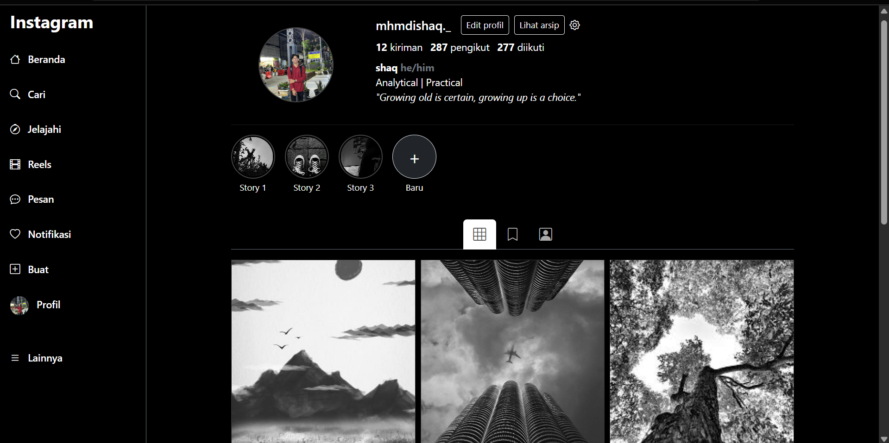
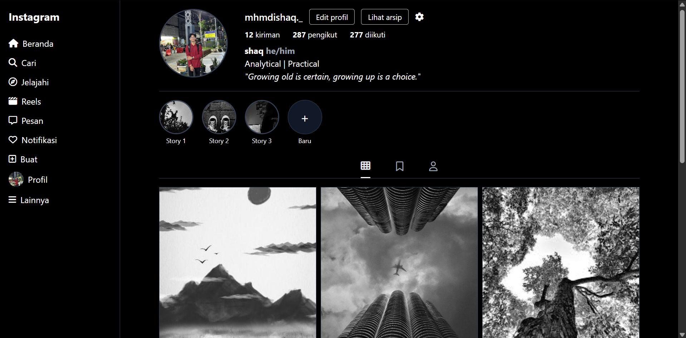

# Profile Instagram

Proyek ini membuat tapilan halaman profile website dengan **HTML**, framework **Tailwind CSS**, dan **Bootstrap 5**.

---

## Cara Kerja Tailwind & Bootstrap via CDN

### Bootstrap CSS

```html
<link
  href="https://cdn.jsdelivr.net/npm/bootstrap@5.3.3/dist/css/bootstrap.min.css"
  rel="stylesheet"
/>
```

- Framework CSS dengan kumpulan komponen siap pakai.
- Menyediakan grid system, komponen UI, dan utility class bawaan.
- Baik untuk membuat tampilan dengan cepat hingga aplikasi berskala besar.

---

### Tailwind CSS

```html
<script src="https://cdn.tailwindcss.com"></script>
```

- Mengambil class utility langsung dari file HTML.
- Mekanisme Just-in-Time (JIT) memastikan hanya class yang dipakai yang akan dimuat.
- Hasil CSS disisipkan otomatis ke <head>.
- Cocok untuk belajar & prototyping.

---

## Penjelasan Utility Class Tailwind

Tailwind adalah framework **utility-first**, artinya styling ditulis langsung di atribut `class`.

### 1. Layout & Struktur Halaman

- `flex min-h-screen` → Layout utama pakai flexbox, tinggi penuh layar.
- `w-1/5` → Sidebar lebar **20%**.
- `flex-1` → Konten utama ambil sisa ruang.
- `hidden md:flex` → Sidebar hanya muncul di layar medium ke atas.

### 2. Navigasi Sidebar

- `px-5 py-3` → Padding menu.
- `hover:bg-gray-900 rounded-lg` → Efek hover.
- `font-bold` → Menandai link aktif.

### 3. Bagian Profil

- `flex flex-col md:flex-row md:items-center` → Responsif, vertikal → horizontal.
- `w-24 h-24 md:w-32 md:h-32` → Foto profil responsif.
- `rounded-full object-cover` → Foto bulat & proporsional.
- `text-2xl font-bold` → Username besar & tebal.

### 4. Statistik Profil

- `flex mb-2` → Data sejajar.
- `font-medium mr-5` → Teks tebal & ada jarak antar item.

### 5. Bio

- `text-gray-400 text-sm` → Teks kecil warna abu.

### 6. Grid Postingan

- `grid grid-cols-1 sm:grid-cols-2 md:grid-cols-3 gap-3` → Grid responsif.
- `relative group` → Bungkus gambar untuk overlay.
- `opacity-0 group-hover:opacity-100 transition-opacity` → Overlay muncul saat hover.

---

## Penjelasan Fitur Bootstrap

Bootstrap adalah framework CSS open-source dengan komponen UI siap pakai.

### Fitur Utama

- **Grid System** → Layout fleksibel, responsif.
- **Komponen UI** → Navbar, card, modal, tombol.
- **Utility Classes** → Styling cepat (margin, padding, teks).
- **Responsiveness** → Otomatis menyesuaikan semua ukuran layar.
- **Cross-Browser** → Didukung banyak browser.

### 1. Layout & Struktur

- `container-fluid` → Lebar penuh.
- `row` & `col-md-*` → Membagi halaman ke kolom.

### 2. Sidebar

- `d-flex flex-column` → Navigasi vertikal.
- `fw-bold` → Teks tebal untuk link aktif.

### 3. Bagian Profil

- `d-flex flex-column flex-md-row` → Vertikal → horizontal.
- `me-md-4` → Margin kanan di layar medium.
- `btn btn-outline-light btn-sm` → Tombol kecil dengan border putih.

### 4. Statistik

- `d-flex mb-2` → Statistik sejajar.
- `stat` (class custom) → Mengatur jarak & gaya teks.

### 5. Grid Postingan

- `row g-3` → Grid dengan jarak antar kolom.
- `col-12 col-sm-6 col-md-4` → Grid responsif: 1, 2, atau 3 kolom.
- Overlay dibuat dengan CSS custom (`.post-overlay`).

---

## Responsifitas

- Tailwind menggunakan Mobile-first, class seperti `sm:`, `md:`, `lg:` untuk breakpoint.
- Bootstrap mengunakan class grid & utility responsive (`col-sm-`, `col-md-`, `d-none d-md-block`).

---

## Pertanyaan & Jawaban Bootstrap

**1. Mengapa memilih konfigurasi `col-` tertentu untuk tiap breakpoint?**

- Setiap breakpoint dipilih untuk **mengatur jumlah kolom postingan** sesuai lebar layar, agar tampilan konsisten dan responsif.

**2. Bagaimana memastikan tombol Follow / Edit Profile tetap mudah dijangkau di mobile?**

- Gunakan `d-flex flex-wrap` dan `mb-1` pada tombol supaya **tidak tumpang tindih** dan tetap mudah ditekan.

**3. Jika postingan bertambah menjadi 50, apa potensi masalah dan bagaimana mengatasinya?**

- Potensi masalah: **loading lama, scroll panjang, performa menurun**.
- Solusi: **pagination, infinite scroll, lazy loading gambar, grid virtualisasi**.

---

## Pertanyaan & Jawaban Tailwind

**1. Jelaskan keputusan `grid-cols` / `gap` di tiap breakpoint — kenapa begitu?**

- Mobile: 1 kolom, Small: 2 kolom, Medium: 3 kolom, Gap: 3 → memastikan tampilan rapi dan proporsional.

**2. Bagaimana memanfaatkan utility responsive Tailwind untuk memecahkan masalah layout di mobile?**

- Gunakan responsive prefix (`sm:`, `md:`, `lg:`) untuk mengubah layout sesuai ukuran layar.

**3. Trade-off antara memakai banyak utility classes vs membuat component CSS tersendiri**

- Utility classes: cepat prototyping, fleksibel, tapi HTML panjang.
- Component CSS: HTML bersih, bisa reuse, tapi perlu tulis CSS tambahan.

---

## Preview

### Preview Boostrap CSS



### Preview Tailwind CSS


